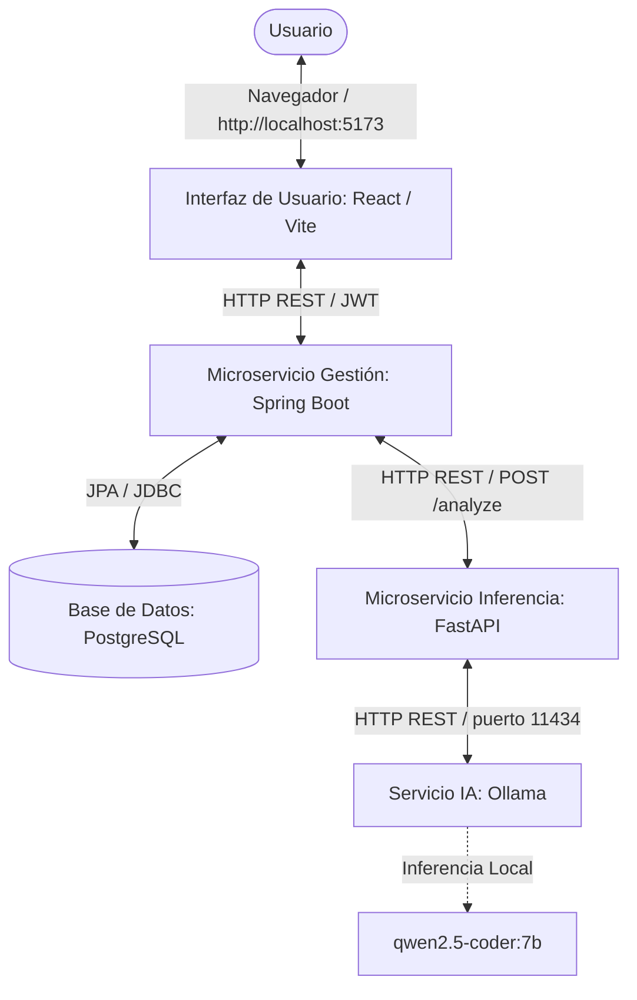

# 🔍 Code Audit AI

<div align="center">
  
  
  
  
  
  
  
  
  
  
  

  <h3>Plataforma de Auditoría de Código y Detección de Vulnerabilidades con Inteligencia Artificial Local</h3>

  <p align="center">
    Un sistema políglota distribuido en microservicios diseñado para analizar código fuente (Python, Java, Kotlin) en tiempo real de forma 100% privada, gratuita y offline.
  </p>
</div>

---

## 📌 ¿Qué es el proyecto?

**Code Audit AI** es una plataforma web e infraestructura de microservicios diseñada para auditar código fuente y detectar vulnerabilidades de seguridad, errores de sintaxis y problemas de calidad de código. 

La principal ventaja competitiva del sistema es que realiza toda la inferencia de Inteligencia Artificial de forma **local y privada** utilizando un motor de **Ollama** con el modelo especializado `qwen2.5-coder:7b`. Esto garantiza que el código analizado nunca sea enviado a servidores externos ni APIs en la nube (como OpenAI o Claude), protegiendo la confidencialidad de la información sin generar costes de consumo de tokens.

El proyecto está diseñado bajo una arquitectura de microservicios robusta y modular, permitiendo un desacoplamiento total entre la interfaz de usuario, la gestión de persistencia de datos empresarial y el motor de inferencia de IA.

---

## 🏗️ Arquitectura de Microservicios

El sistema consta de **5 componentes principales** que se comunican de forma síncrona mediante HTTP/REST en una red aislada (Bridge) administrada por Docker:



1. **`interfaz_usuario` (Frontend):** SPA desarrollada en React y Vite. Incluye integración con el editor profesional **Monaco Editor** (con un límite preventivo de 2000 caracteres para optimizar tiempos de respuesta de la IA) e interfaces dinámicas para visualización de métricas de calidad y severidad de fallos.
2. **`microservicio_gestion_persistencia` (Backend Orquestador):** Construido en Java 21 y Spring Boot. Se encarga de la lógica empresarial, autenticación de usuarios mediante tokens JWT (Spring Security), auditoría de solicitudes y almacenamiento del historial.
3. **`postgres` (Base de Datos Relacional):** Instancia de PostgreSQL que persiste de forma segura las credenciales de usuarios, los metadatos de auditoría y los análisis históricos.
4. **`microservicio_inferencia_analisis` (Servicio de Inferencia):** Microservicio ligero desarrollado en Python con FastAPI. Realiza ingeniería de prompts de manera dinámica, formatea los prompts que recibe de Java y consulta al motor de Ollama. Valida rigurosamente la salida utilizando Pydantic antes de retornarla a Java para evitar errores de deserialización.
5. **`ollama` (Motor de IA):** Contenedor Docker pre-configurado que corre el servicio oficial de Ollama y gestiona de forma automatizada la descarga e inicialización local del modelo `qwen2.5-coder:7b`.

---

## 🛠️ Stack Tecnológico

| Capa | Componente / Tecnología | Versión | Rol principal en el sistema |
| :--- | :--- | :--- | :--- |
| **Frontend** | [React](https://react.dev/) + [Vite](https://vitejs.dev/) | React 18 / Vite 5 | Interfaz web interactiva e interactiva. |
| **Frontend** | [Tailwind CSS](https://tailwindcss.com/) | v3 | Maquetación y diseño visual premium responsivo. |
| **Frontend** | Monaco Editor | - | Editor de código integrado para copiar/pegar y resaltar sintaxis. |
| **Backend** | [Spring Boot](https://spring.io/projects/spring-boot) | Java 21 | Orquestador de negocio, seguridad (JWT) y auditoría. |
| **Base de Datos** | [PostgreSQL](https://www.postgresql.org/) | v16 Alpine | Motor de base de datos relacional persistente. |
| **Inferencia** | [FastAPI](https://fastapi.tiangolo.com/) | Python 3.10+ | Gestión ligera y asíncrona de peticiones hacia Ollama. |
| **Inferencia** | [Pydantic](https://docs.pydantic.dev/) | v2 | Validación y parseo estricto de JSONs estructurados por la IA. |
| **Motor IA** | [Ollama](https://ollama.com/) | Latest | Servidor de modelos de lenguaje local. |
| **Modelo LLM** | `qwen2.5-coder:7b` | 7 Billones | Modelo especializado en generación, refactorización y auditoría de código. |
| **Orquestación** | [Docker Compose](https://docs.docker.com/compose/) | v2+ | Aislamiento y despliegue del stack completo de servicios. |

---

## 🚀 Instalación y Ejecución Rápida

La forma recomendada de ejecutar toda la plataforma sin necesidad de instalar dependencias locales (como JDK, Python, Postgres u Ollama en tu sistema host) es mediante contenedores Docker.

### Requisitos Previos

1. Tener instalado [Docker Desktop](https://www.docker.com/products/docker-desktop/).
2. Asegurarse de que Docker Desktop esté abierto y corriendo (`Engine running`).
3. Para la primera ejecución, se requiere conexión a internet para descargar las imágenes y el modelo de IA (~4.7 GB).
4. **Hardware recomendado:** Mínimo 8 GB de RAM (recomendado 16 GB) para una fluida inferencia local.

---

### Modo A: Todo en Docker (Recomendado)

Disponemos de scripts automatizados para sistemas Windows que facilitan el ciclo de vida del sistema.

#### 1. Iniciar el Sistema
Haz **doble clic** sobre el archivo [Iniciar.lnk](file:///d:/Github/Programacion_Vanguardia/TP_Arquitectura_de_Microservicios/Arquitectura_de_microservicios_Prog_Vang/Iniciar.lnk) en la raíz del repositorio, o ejecuta desde una terminal de PowerShell:
```powershell
.\Scripts\Iniciar.bat
```

**¿Qué hace este script de forma automatizada?**
* Verifica que Docker Desktop esté en ejecución.
* Levanta todos los servicios en segundo plano (`docker compose up -d --build`).
* **Descarga automáticamente el modelo `qwen2.5-coder:7b`** en el contenedor de Ollama (solo ocurre en el primer inicio).
* Realiza peticiones de verificación de salud en bucle esperando que el Backend en Java (puerto `8080`) y el Frontend (puerto `5173`) estén totalmente inicializados.
* Abre automáticamente tu navegador predeterminado en `http://localhost:5173`.

#### 2. Detener el Sistema
Para apagar todos los contenedores y liberar memoria RAM/CPU, haz **doble clic** en [Detener.lnk](file:///d:/Github/Programacion_Vanguardia/TP_Arquitectura_de_Microservicios/Arquitectura_de_microservicios_Prog_Vang/Detener.lnk) o ejecuta:
```powershell
.\Scripts\Detener.bat
```
*Los datos e historial de auditorías no se perderán, ya que se guardan en un volumen persistente de Docker.*

---

### Modo B: Ollama en el Host (Para aceleración por GPU/VRAM)
Si dispones de una tarjeta gráfica dedicada (NVIDIA/AMD) y quieres que las respuestas de la IA sean instantáneas, es preferible correr Ollama directamente en tu sistema host para que pueda aprovechar el hardware nativo:

1. Descarga e instala [Ollama](https://ollama.com/) en tu sistema operativo.
2. Abre una terminal de tu sistema y ejecuta:
   ```bash
   ollama pull qwen2.5-coder:7b
   ollama serve
   ```
3. En otra terminal, parado en la raíz del proyecto, levanta el resto de microservicios indicándole a Docker que redireccione las llamadas de inferencia a tu máquina host:
   ```bash
   docker compose -f docker-compose/docker-compose.yml -f docker-compose/docker-compose.ollama-host.yml up -d postgres
   docker compose -f docker-compose/docker-compose.yml -f docker-compose/docker-compose.ollama-host.yml up -d --no-deps microservicio_inferencia_analisis
   docker compose -f docker-compose/docker-compose.yml -f docker-compose/docker-compose.ollama-host.yml up -d microservicio_gestion_persistencia interfaz_usuario
   ```
4. Abre [http://localhost:5173](http://localhost:5173).

---

## 🔍 Verificación del Estado de los Servicios

Una vez iniciado el sistema, puedes comprobar el estado de cada servicio individualmente:

| Componente | URL de Acceso / Chequeo | Respuesta Esperada | Acceso Público |
| :--- | :--- | :--- | :--- |
| **Frontend** | [http://localhost:5173](http://localhost:5173) | Pantalla de Login / Dashboard interactivo | Sí |
| **Backend Java** | [http://localhost:8080/test](http://localhost:8080/test) | Retorna texto plano: `"Java OK"` | Sí |
| **Backend Swagger** | [http://localhost:8080/swagger-ui/index.html](http://localhost:8080/swagger-ui/index.html) | Documentación interactiva de APIs de Java | Sí |
| **Microservicio Python** | [http://localhost:5000/test](http://localhost:5000/test) | JSON: `{ "status": "ok", "ollama_available": true, "model": "qwen2.5-coder:7b" }` | Sí |
| **Motor de Ollama** | [http://localhost:11434](http://localhost:11434) | Mensaje plano: `"Ollama is running"` | Sí |

> [!NOTE]
> Si intentas acceder a la raíz del backend Java `http://localhost:8080/` o a endpoints protegidos sin un Token válido, recibirás un error HTTP **403 Forbidden**. Es un comportamiento esperado por el sistema de seguridad JWT de Spring Security, no una falla en el despliegue.

---

## 🛠️ Guía de Desarrollo Local

Si deseas modificar el código y requieres recarga en caliente (Hot Module Replacement) para el Frontend:

1. **Levantar infraestructura básica en Docker:**
   ```bash
   docker compose up -d postgres ollama microservicio_inferencia_analisis microservicio_gestion_persistencia
   ```
2. **Ejecutar Frontend en modo desarrollo (con HMR):**
   ```bash
   cd Interfaz_usuario
   npm install
   npm run dev
   ```
3. El frontend de desarrollo se abrirá en [http://localhost:5173](http://localhost:5173) comunicándose con los contenedores de backend.

---

## 📚 Documentación Técnica Detallada

Si deseas profundizar en aspectos técnicos de la implementación, consulta los archivos en la carpeta [Documentacion](file:///d:/Github/Programacion_Vanguardia/TP_Arquitectura_de_Microservicios/Arquitectura_de_microservicios_Prog_Vang/Documentacion):
* [Comunicación entre Java y Python](file:///d:/Github/Programacion_Vanguardia/TP_Arquitectura_de_Microservicios/Arquitectura_de_microservicios_Prog_Vang/Documentacion/Comunicacion-Python-Java.md): Detalles sobre contratos JSON, DTOs y manejo de red interna de Docker.
* [Conclusiones del Proyecto](file:///d:/Github/Programacion_Vanguardia/TP_Arquitectura_de_Microservicios/Arquitectura_de_microservicios_Prog_Vang/Documentacion/Conclusiones.md): Análisis comparativo de inferencia local vs. la nube, retos de no-determinismo y resiliencia de hilos HTTP.
* [Diagrama de Arquitectura Interactivo](file:///d:/Github/Programacion_Vanguardia/TP_Arquitectura_de_Microservicios/Arquitectura_de_microservicios_Prog_Vang/Documentacion/Diagrama-arquitectura.html): Renderización interactiva en HTML que explica visualmente el flujo de datos y dependencias.
